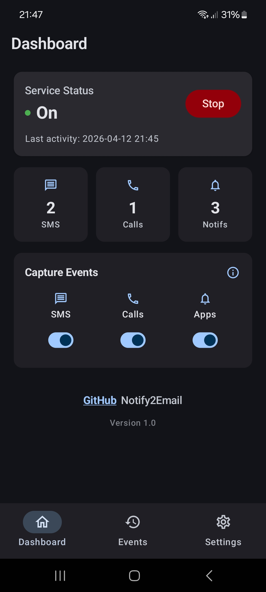
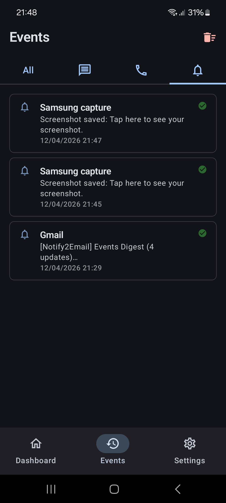
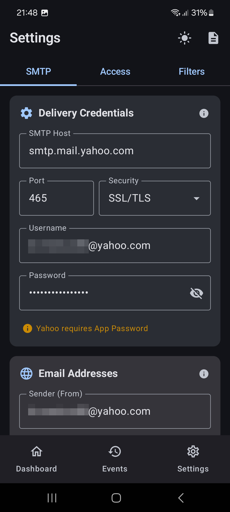
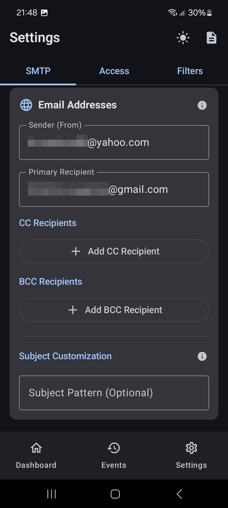
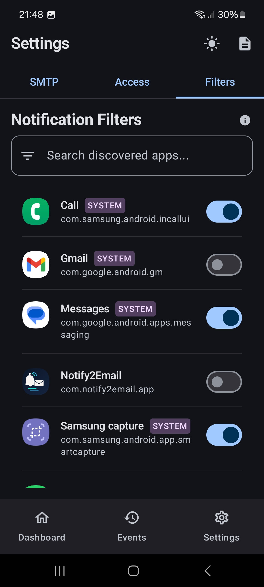

# Notify2Email

Notify2Email is an Android utility application that monitors your phone's events—such as incoming notifications, missed calls, and SMS—and forwards them to your specified email address. This is particularly useful for staying updated on phone activity while working on a computer or when you don't have your phone immediately accessible.

## Features

-   **Notification Forwarding**: Captures notifications from selected apps and sends them via email.
-   **Call Logging**: Specifically identifies and labels "MISSED CALL" and "PHONE CALL" events.
-   **SMS Forwarding**: Forwards incoming text messages.
-   **Advanced Email Routing**:
    -   **Multi-Recipient Support**: Add multiple **CC** and **BCC** addresses to keep different accounts or people in the loop.
    -   **Flexible Notifications**: Use CC for visible transparency among recipients or BCC for private archival and monitoring.
-   **Customizable Email Subjects**: Define a **Custom Subject Pattern** to easily filter, search, or categorize incoming event emails in your inbox.
-   **Smart Deduplication**: Prevents redundant logs from system communication apps (like default dialers and SMS apps) to avoid double-reporting.
-   **Event Batching**: Batches events to reduce the number of emails sent.
-   **Customizable Filters**: Control which apps are allowed to send notifications.
-   **Secure SMTP**: Supports custom SMTP configurations, including required App Passwords for providers like Yahoo.
-   **System Logs**: In-app terminal to monitor service status and event captures.

## Screenshots

*Note: Replace these placeholders with actual screenshots from the `screenshots/` directory if available.*

     

## Installation & Build

### Prerequisites

-   Android Studio Jellyfish or newer.
-   JDK 17.
-   An Android device running Android 8.0 (Oreo) or higher.

### Building the APK

1.  **Clone the repository**:
    ```bash
    git clone https://github.com/yourusername/phone_events_to_email.git
    cd phone_events_to_email
    ```

2.  **Open in Android Studio**:
    Launch Android Studio and select "Open" then navigate to the cloned folder.

3.  **Build via Gradle**:
    You can build the APK directly in Android Studio via `Build > Build Bundle(s) / APK(s) > Build APK(s)` or using the command line:
    ```bash
    ./gradlew assembleDebug
    ```
    The generated APK will be located in `app/build/outputs/apk/debug/`.

## Configuration

1.  **Grant Permissions**: Upon first launch, the app will request:
    -   Notification Access (required for capturing notifications).
    -   Call Log & SMS Permissions (required for call/text tracking).
    -   Battery Optimization Exemption (recommended for reliable background operation).
2.  **Setup SMTP**:
    -   Go to the **Settings** tab.
    -   Enter your SMTP server (e.g., `smtp.mail.yahoo.com`), port, and credentials.
    -   **Important**: Use an **App Password** if your provider (like Yahoo or Gmail) uses 2FA.
3.  **Test Connection**: Use the "Test Connection" button to verify your email settings.

## Technical Details

-   **Jakarta Mail**: Used for SMTP communication.
-   **Room Database**: For local logging and event persistence.
-   **Jetpack Compose**: For a modern, responsive UI.
-   **NotificationListenerService**: To intercept system-level notifications.
-   **ContentObserver**: To monitor real-time changes in Call Logs.

## Privacy

Notify2Email processes your notifications and logs locally on your device and sends them directly to the SMTP server you configure. No data is sent to any third-party servers other than your chosen email provider.

## License

This project is licensed under the MIT License - see the [LICENSE](LICENSE) file for details.
